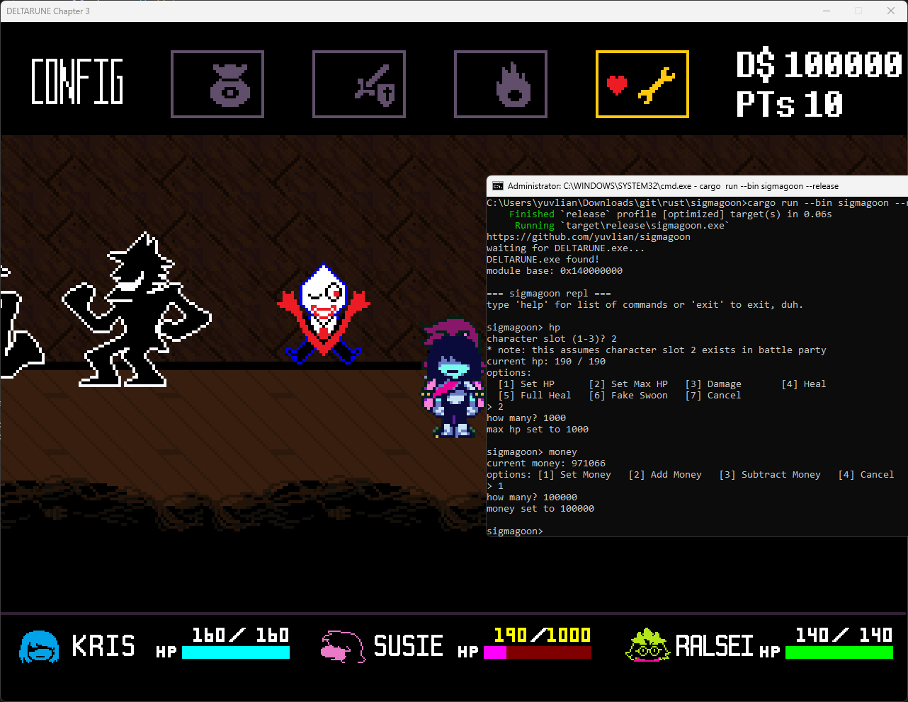

# sigmagoon

`delta -> sigma` + `rune -> goon`. a basic cheat for deltarune (Windows) written in rust.

PLEASE READ THIS ENTIRE README PLEASEEEEEEEEEEE

## screenshots

## project structure

`./memory` -> crate to deal with read/write for deltarune, abstracted with struct `DeltaruneView` and `DeltaruneError`

`./cheats/*` -> crates that uses `DeltaruneView` to cheat with the game. right now there are hp & money.

`./cheats/speed` -> cdylib crate that is a mini impl of cheat engine's speedhack

`./sigmagoon` -> example crate that makes use of memory & cheats. since they are reusable you can just make your own i suppose. i just made it good enough for my own use case.

## how it works

### money hack

1. resolve pointer chain
2. write/read value of the addr

### hp hack

1. resolve pointer chain for 1st in party's current hp (Kris' cur hp)
  - when we add `-0x200` to that address, we get the max_hp address
  - when we add `0x10` to that address, we get the next party member's current hp.
    - which we can then also add `-0x200` to get max_hp of the next party member
2. write/read value of the addr

### speed hack

1. this is a dll
2. it uses the `ilhook` crate to "patch" gettickcount, timegettime, and queryperformancecounter
3. the speedhack value is loaded from env variable `SIGMAGOON_SPD_VAL` with a negative value as reset sentinel
4. yeah thats it

## how to use

### setup

1. have rust & cargo installed properly
2. clone this repo
3. cargo build --release
4. cargo run --bin sigmagoon

- you can also skip all of the steps above and download prebuilt from releases page.
- with the prebuilt, all you have to do is extract zip and run the .exe :)
- you can get the prebuilt here: https://github.com/yuvlian/sigmagoon/releases 
- be sure to not confuse the prebuilt with the source file when downloading!

### usage guide

in my opinion, the REPL itself should be self explanatory.

You just type a command, number, and enter. look at screenshots to see usage example.

however, be sure to only run this cheat when you have actually loaded into the game and not in chapter/save select menu!! 

because the deltarune game starts a new process when you play a chapter!

## misc

### tested in

chapter 3. should work with other chapters though. TODO: test in more chapters

### credits

- `Jevil` for beating my ass
- `Pink` for giving me a jaboner
- `Me` for having the ~~Will~~ DETERMINATION to make this without even looking at how GameMaker Studio 2 works lmao
